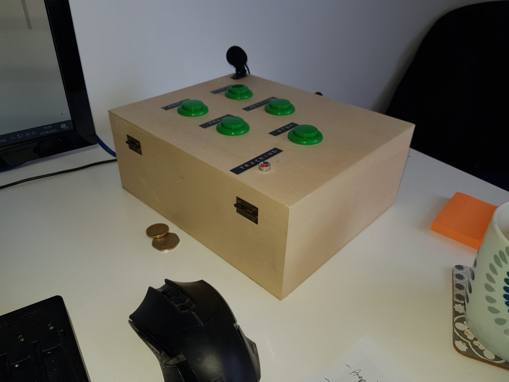

# Track in a box

## Overview

This is a box that allows you to start tracking time by using a few buttons rather than the timecamp web gui. I always struggled with timecamp (either it crashed or I didn't have it open) when I received a phone call or when a meeting was about to start and this helped as when the phone rang I could just tap the 'phone' task and say who was calling and that would end up in timecamp.

In a nutshell it works like this:

* Tap a button to start time tracking
* Describe what you are doing into the mic
* Start working on the task and press the stop button when you are finished.

## Set up

The hardware is esentially a raspberry pi with a few buttons and a mic plugged in. If more details are required for hardware, let me know and I'll update this.

For the software side:

* Set your timecamp api key in timecamp.py
* Set your task id's in main.py
* Set pins in main.py

## Run as systemd service

It's better to run it this way as it means that you do not have to start the program manually every time the pi is switched on. Before doing this, ensure that
tia can run properly without any errors.

First, make a new tia service by running: 

    sudo systemctl --force --full edit tia.service

Add the following:

    Description=Start Tia program on boot
    After=multi-user.target
    
    [Service]
    User=pi
    WorkingDirectory=/home/pi/tia/
    ExecStart=python3 main.py
    
    [Install]
    WantedBy=multi-user.target

Enable and monitor the service with:    
    
    systemctl status myscript.service
    sudo systemctl enable --now myscript.service

The output of the print() statements you will find in the journal:

    journalctl -b -e

## Development

### Project Tracking and repo

https://gitlab.com/tia-tracker/tia

There is a kanban board here too:
https://gitlab.com/tia-tracker/tia/-/issues

### Script to start the project

    rm -rf /home/vivi/pimount/tia/.idea;
    rmdir /home/vivi/pimount/tia;
    #mkdir /home/vivi/pimount;
    sshfs pi@192.168.1.29:/home/pi /home/vivi/pimount;
    ssh 192.168.1.29 -l pi;

